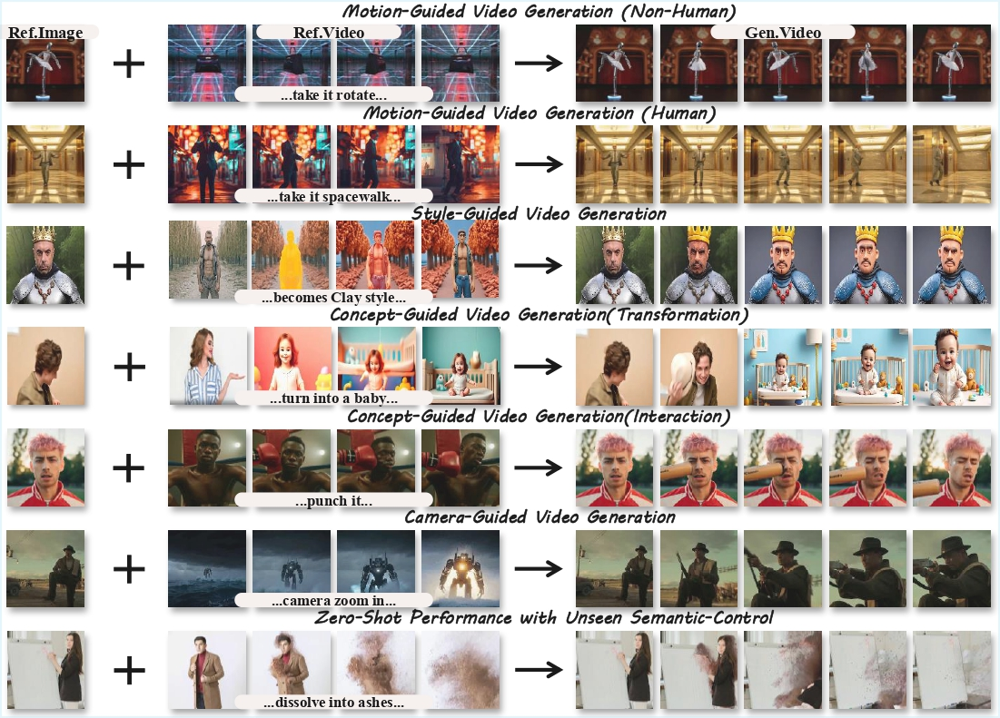
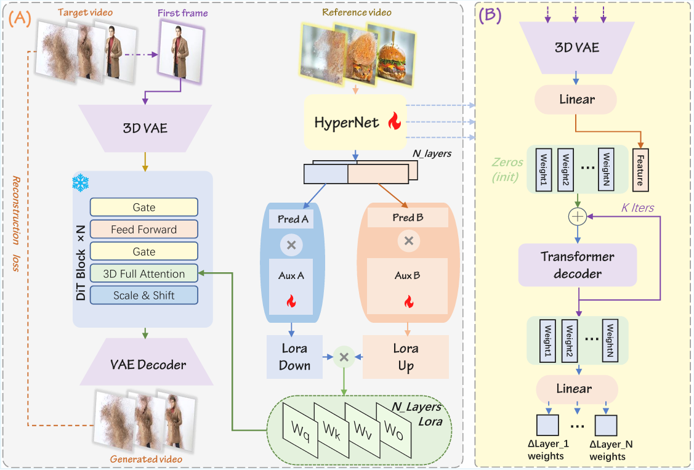

# Video2LoRA
*Customizing a dedicated semantic LoRA for each reference video.*

### Unified Semantic-Controlled Video Generation via Per-Reference-Video LoRA  
**CVPR 2026 Findings**

Official implementation of the paper **"Video2LoRA: Unified Semantic-Controlled Video Generation via Per-Reference-Video LoRA"**.

> Video2LoRA enables semantic video generation by dynamically predicting lightweight LoRA adapters from reference videos using a HyperNetwork, without requiring per-condition fine-tuning.
---

# 🔥 Highlights

Video2LoRA introduces a new paradigm for **semantic-controlled video generation**.

Instead of training separate models or LoRA adapters for each semantic condition (e.g., visual effects, camera motion, style), our framework **predicts semantic-specific LoRA weights directly from a reference video**.

Key features:

* 🎬 **Reference-driven semantic video generation**
* ⚡ **Ultra-lightweight LoRA (<50 KB per semantic condition)**
* 🧠 **Transformer-based HyperNetwork for LoRA prediction**
* 🌍 **Strong zero-shot generalization**
* 🧩 **Unified framework across heterogeneous semantic controls**

---

# 🧠 Method Overview



Video2LoRA consists of three key components:

## 1. LightLoRA Representation

We introduce **LightLoRA**, a compact LoRA formulation that decomposes the standard LoRA matrices:

$$
A = A_{\text{aux}} A_{\text{pred}}, \quad
B = B_{\text{pred}} B_{\text{aux}}
$$

Where:

* $A_{\text{aux}}, B_{\text{aux}}$: trainable auxiliary matrices
* $A_{\text{pred}}, B_{\text{pred}}$: predicted by the HyperNetwork

This design significantly reduces parameter size while preserving semantic adaptability.

Each semantic condition requires **less than 50 KB** parameters.

---

## 2. HyperNetwork for LoRA Prediction

A **Transformer-based HyperNetwork** predicts semantic-specific LoRA weights conditioned on a reference video.

Pipeline:

```
Reference Video
      ↓
3D VAE Encoder
      ↓
Spatio-temporal features
      ↓
Transformer Decoder
      ↓
Predicted LoRA weights
```

These predicted LoRA modules are injected into the frozen diffusion backbone.

---

## 3. End-to-End Diffusion Training

Unlike prior methods that require:

* pretrained semantic LoRA weights
* multi-stage training pipelines

Video2LoRA is trained **end-to-end using only the standard diffusion objective**.

---

# 🌍 Zero-Shot Semantic Generation

Video2LoRA generalizes well to **unseen semantic conditions**.

Even when encountering **out-of-domain visual effects**, the model can generate semantically aligned videos based on reference videos.

Example semantic controls include:

* visual effects (VFX)
* camera motion
* object stylization
* character transformations
* artistic styles

---

# 📂 Dataset

Video2LoRA follows the dataset format used in VideoX-Fun, which supports mixed image and video training with text descriptions.

Organize your dataset in the following structure:

```
project/
│
├── datasets/
│   ├── internal_datasets/
│   │
│   ├── train/
│   │    ├── 00000001.mp4
│   │    ├── 00000002.jpg
│   │    ├── 00000003.mp4
│   │    └── ...
│   │
│   └── json_of_internal_datasets.json
```

## 📝 JSON Annotation Format

```json
[
  {
    "file_path": "train/00000001.mp4",
    "text": "A group of young men in suits and sunglasses walking down a city street.",
    "type": "video"
  },
  {
    "file_path": "train/00000002.jpg",
    "text": "A group of young men in suits and sunglasses walking down a city street.",
    "type": "image"
  }
]
```

---

# ⚙️ Installation

## Clone repository

```bash
git clone https://github.com/BerserkerVV/Video2LoRA.git  
cd Video2LoRA
```

## Create environment

```bash
conda create -n video2lora python=3.10
conda activate video2lora
```

## Install dependencies

```bash
pip install -r requirements.txt
```

---

# 🚀 Training

Train Video2LoRA:

```bash
bash scripts/cogvideoxfun/train_lora.sh
```

Training setup:

| Item       | Value                     |
|------------|---------------------------|
| Backbone   | CogVideoX-Fun-V1.1-5b-InP |
| GPUs       | 8 × NVIDIA A800           |
| Iterations | 20K                       |
| Frames     | 49                        |
| FPS        | 8                         |
| Resolution | 512, 768, 1024, 1280      |

---

# 🎥 Inference

Generate a video using a reference video:

```bash
bash examples/cogvideox_fun/run_predict_i2v.sh
```

---

# 📖 Citation

If you find our work useful, please cite:

```bibtex
@misc{wu2026video2loraunifiedsemanticcontrolledvideo,
      title={Video2LoRA: Unified Semantic-Controlled Video Generation via Per-Reference-Video LoRA}, 
      author={Zexi Wu and Qinghe Wang and Jing Dai and Baolu Li and Yiming Zhang and Yue Ma and Xu Jia and Hongming Xu},
      year={2026},
      eprint={2603.08210},
      archivePrefix={arXiv},
      primaryClass={cs.CV},
      url={https://arxiv.org/abs/2603.08210}, 
}
```

---

If you find this project useful, please consider starring the repository to support our work.
